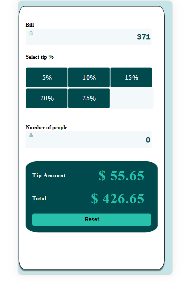

# Frontend Mentor - Tip calculator app solution

This is a solution to the [Tip calculator app challenge on Frontend Mentor](https://www.frontendmentor.io/challenges/tip-calculator-app-ugJNGbJUX). Frontend Mentor challenges help you improve your coding skills by building realistic projects.

## Table of contents

- [The challenge](#the-challenge)
- [Screenshot](#screenshot)
- [Links](#links)
- [My process](#my-process)
  - [Built with](#built-with)
  - [What I learned](#what-i-learned)
  - [Continued development](#continued-development)
  - [Useful resources](#useful-resources)
- [Author](#author)

### Screenshot

The first screenshot:


### Links

- Solution URL: [Add solution URL here](https://your-solution-url.com)
- Live Site URL: [Add live site URL here](https://your-live-site-url.com)

## My process

The first thing that I did was to draw on scratch paper the structure of the components, including a component tree.


After applying design to the website, it looks like this:


The first part of the design is completed;


Mobile design:


### Built with

- Semantic HTML5 markup
- CSS custom properties
- Flexbox
- CSS Grid
- Mobile-first workflow
- [React](https://reactjs.org/) - JS library

### What I learned

One trick that I learned in this challenge is using margin-top: auto; to put an element on the bottom.

```css
.reset_button {
  height: 30px;
  margin-top: auto;
  ...;
}
```

This is how you only allow numbers in the <input>:

```js
const [inputValue, setInputValue] = useState(0);

const handleInputValue = (e) => {
  const value = e.target.value;

  // Allow only numeric values and an optional dot
  const sanitizedValue = value.replace(/[^0-9.]/g, "");

  setInputValue(sanitizedValue);
};

<input
  type="text"
  value={inputValue}
  onChange={handleInputValue}
  className="bill_inputs"
/>;
```

### Continued development

I need to continue improving my skills in React, and with this project, I have learned when I need the State to the closest parent component.

## Author

- Instagram - [@juan_gszs](https://www.instagram.com/juan_gszs/)
- Frontend Mentor - [@Galvez121](https://www.frontendmentor.io/profile/Galvez121)https://www.frontendmentor.io/profile/Galvez121)
